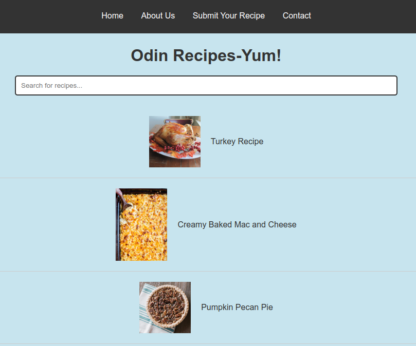

# :stew: Odin Recipes Website

Welcome to Odin Recipes Website. This website is a demonstration of understanding HTML, CSS, and a bit of JavaScript in creating a responsive and interactive website. It features a main landing page with links to individual recipe pages and a pleasant color scheme for easy reading.

## :books: Project Overview

This project has been developed as a part of The Odin Project curriculum. The main purpose was to get comfortable with HTML, CSS layout techniques (Flexbox), and making websites responsive for better user experience on various devices.

The features of this project include:
1. An attractive landing page with a list of recipes.
2. Individual recipe pages providing detailed steps, ingredients, and images.
3. A navigation bar for easy access to main pages.
4. Footer containing social media links.
5. Interactivity added with JavaScript such as ability to cross off ingredients and steps.
6. Use of CSS variables for maintainable and scalable stylesheets.

SPECIAL NOTE:
Only the Home button works in the nav bar and also the footer buttons are for show and not usable. Future versions could have a working navbar and more pages.

## :dart: Code Highlights
- **Navigation bar:** The navbar has been styled using CSS Flexbox for horizontal alignment of links. It's also made responsive to adapt to various screen sizes.
- **Image Styling:** Images in the recipe pages have been styled to appear circular using `border-radius: 50%` for a more aesthetic look.
- **Interactive Lists:** Ingredients and steps can be crossed off in the recipe pages. This has been achieved by adding 'click' event listeners on list items and toggling a 'checked' class.
- **Responsive Design:** The website is mobile-friendly. Media queries have been used to adjust styles based on screen size.
- **CSS Variables:** The stylesheet utilizes CSS variables for the color scheme. This ensures a consistent color palette across the website and allows for easy color changes.

## :bulb: How to Use
- Open the landing page (index.html).
- Click on a recipe name to view the detailed recipe.
- Click on ingredients and steps to cross them off as you complete them.
- Use the navigation bar to visit other pages.

## :pray: Credits
- **The Odin Project** for providing the project in their curriculum.
- Unsplash for the beautfiul images

